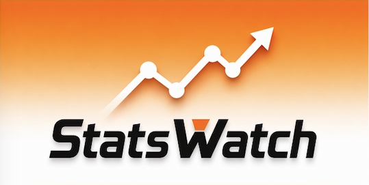

<div align="center">



### Your Ultimate Overwatch Companion on iOS

**Track stats. Master heroes. Climb ranks.**

[](https://swift.org)
[](https://apple.com)
[](LICENSE)

[**中文介绍**](#中文介绍) · [Features](#features) · [Screenshots](#screenshots) · [Installation](#installation) · [Tech Stack](#tech-stack)

</div>

---

## Features

### Player Stats & Analysis
- **Full Profile Viewer** — Search any player by BattleTag, view competitive ranks, win rates, KDA, playtime across all roles
- **Smart Coach** — AI-powered insights: rank estimation, hero pool analysis, personalized improvement tips that adapt to your selected role
- **Play Style Profile** — Discover your playstyle archetype (Aggressive Slayer, Battle Medic, Protective Guardian, etc.) with trait tags and key insights
- **Hero Tier List** — Personal S/A/B/C/D tier ranking based on YOUR performance, not generic meta picks

### Hero & Meta Intelligence
- **Hero Meta Analysis** — Global pick rates and win rates across all heroes, filterable by role and game mode
- **Hero Encyclopedia** — Complete hero database with abilities, hitpoints, backstories, and global performance stats
- **Career Stats Deep Dive** — Per-hero career statistics with category breakdowns (Best, Combat, Game, etc.)

### Competitive Tools
- **Player vs Player** — Compare two players side-by-side with stat bars and role breakdowns
- **Session Tracker** — Start a session before playing, end it after — see exactly how many wins/losses and stat changes per session
- **Progress Tracking** — Historical stat snapshots with line charts to visualize your improvement over time

### Social & Utility
- **Share Card** — Generate a beautiful dark-themed stats card with your ranks, top heroes, and key stats — ready to share on social media
- **Favorites & History** — Save frequent players, quick access to recent searches
- **iOS Home Screen Widget** — Glance at your latest stats without opening the app
- **Maps & Game Modes Gallery** — Browse all maps with game mode filters and country flags

### Global
- **5 Languages** — English, 简体中文, 한국어, 日本語, Español — with in-app language switcher
- **100% Free, No Ads** — Built for the community

---

## Screenshots

| Full Profile | Know Your Style | Hero Tier List | Smart Coach |
|:---:|:---:|:---:|:---:|
|  |  |  |  |
| Ranks, win rates & role stats | AI-powered playstyle analysis | Your personal S/A/B/C/D ranking | Rank estimation & personalized tips |

| Share Card | Hero Deep Dive | Career Stats | Hero vs Hero |
|:---:|:---:|:---:|:---:|
|  |  |  |  |
| Beautiful stats card for sharing | Radar chart & per-10-min averages | Win rates & KDA for every hero | Compare your heroes side by side |

---

## Installation
- Will be avalable on AppStore soon

### Requirements
- iOS 18.0+
- Xcode 26.0+

### Build from Source
```bash
git clone https://github.com/WilliamGuo2002/StatsWatch.git
cd StatsWatch
open StatsWatch.xcodeproj
```
Select your target device/simulator in Xcode and hit **Run (⌘R)**.

No external dependencies — no CocoaPods, no SPM packages. Pure SwiftUI.

---

## Tech Stack

| Layer | Technology |
|---|---|
| UI | SwiftUI, Charts |
| Architecture | @Observable ViewModel, Actor-based services |
| Data Source | [OverFast API](https://overfast-api.tekrop.fr) (all 12 endpoints) |
| Persistence | UserDefaults (local only) |
| Widget | WidgetKit + App Groups |
| Localization | Localizable.strings × 5 languages |
| Image Export | ImageRenderer |

---

## API Coverage

StatsWatch utilizes **100%** of the OverFast API endpoints:

| Endpoint | Usage |
|---|---|
| `/players` | Player search |
| `/players/{id}/summary` | Profile, ranks, endorsement |
| `/players/{id}/stats/summary` | Win rates, KDA, per-10min stats |
| `/players/{id}/stats/career` | Detailed per-hero career stats |
| `/heroes` | Hero list for encyclopedia & meta |
| `/heroes/{id}` | Hero detail (abilities, story, hitpoints) |
| `/heroes/stats` | Global hero pick/win rates |
| `/maps` | Map gallery |
| `/gamemodes` | Game modes browser |
| `/roles` | Role metadata |

---

## Privacy

StatsWatch does **not** collect, store, or transmit any personal data. All user preferences (favorites, search history, stat snapshots) are stored **locally on the device** via UserDefaults. Player data is fetched from publicly available profiles through the OverFast API.

---

## Disclaimer

This is an **unofficial** fan-made application and is not affiliated with, endorsed by, or connected to Blizzard Entertainment, Inc. *Overwatch*, the Overwatch logo, and all related heroes, names, images, and assets are trademarks or registered trademarks of Blizzard Entertainment, Inc.

---

## Support

- **Bug Report / Feature Request** — In-app Feedback & Tip page, or email [wgstudiosupport@gmail.com](mailto:wgstudiosupport@gmail.com)
- **Tip the Developer** — [PayPal](https://paypal.me/wg1018)

---

<div align="center">

Made with ❤️ for the Overwatch community

</div>

---

<a id="中文介绍"></a>

## 中文介绍

<div align="center">

### StatsWatch — 你的守望先锋 iOS 数据伴侣

**查战绩、研究英雄、冲分必备。**

</div>

---

### 功能一览

#### 玩家数据与分析
- **完整战绩查询** — 搜索任意玩家战网ID，查看竞技排名、胜率、KDA、各职业游戏时长
- **智能教练** — AI 驱动的段位参考估算、英雄池分析、个性化提升建议，根据选择的职业自动调整内容
- **游戏风格画像** — 分析你的风格类型（激进杀手、战斗奶妈、钢铁堡垒等），附带特征标签和关键洞察
- **英雄等级表** — 基于你自己的数据生成 S/A/B/C/D 分级，而非通用 Meta 排行

#### 英雄与 Meta 情报
- **英雄 Meta 分析** — 全英雄选取率 / 胜率排行，支持按职业和游戏模式筛选
- **英雄百科** — 完整英雄数据库：技能、血量、背景故事、全球表现数据
- **生涯数据详览** — 每个英雄的详细生涯统计，按类别分组（最佳、战斗、游戏等）

#### 竞技工具
- **玩家 PvP 对比** — 两个玩家数据并排对比，含数据条和职业分析
- **对局追踪** — 开打前开始记录，打完后查看胜负变化和数据波动
- **进步追踪** — 历史数据快照 + 折线图，直观展示你的成长轨迹

#### 社交与实用
- **分享卡片** — 生成精美深色主题数据卡，包含段位、常用英雄和关键数据，一键分享到社交媒体
- **收藏与历史** — 收藏常用玩家，快速访问最近搜索记录
- **iOS 桌面小组件** — 不打开 App 也能一览最新数据
- **地图与模式图鉴** — 浏览所有地图，支持游戏模式筛选和国旗标识

#### 全球化
- **5 种语言** — English、简体中文、한국어、日本語、Español，App 内随时切换
- **完全免费，无广告** — 为社区而生

---

### 截图预览

| 完整战绩 | 风格分析 | 英雄等级 | 智能教练 |
|:---:|:---:|:---:|:---:|
|  |  |  |  |
| 段位、胜率、职业数据一览 | AI 驱动的游戏风格分析 | 你的专属 S/A/B/C/D 排行 | 段位估算与个性化建议 |

| 分享卡片 | 英雄详情 | 生涯数据 | 英雄对比 |
|:---:|:---:|:---:|:---:|
|  |  |  |  |
| 一键生成精美数据卡 | 雷达图与场均数据 | 每个英雄的胜率与 KDA | 英雄数据并排对比 |

---

### 安装

- 即将上架 App Store

#### 系统要求
- iOS 18.0+
- Xcode 26.0+

#### 从源码构建
```bash
git clone https://github.com/WilliamGuo2002/StatsWatch.git
cd StatsWatch
open StatsWatch.xcodeproj
```
在 Xcode 中选择目标设备/模拟器，点击 **Run (⌘R)** 即可运行。

无任何外部依赖 — 不使用 CocoaPods，不使用 SPM。纯 SwiftUI 构建。

---

### 技术栈

| 层级 | 技术 |
|---|---|
| UI | SwiftUI, Charts |
| 架构 | @Observable ViewModel, Actor-based Services |
| 数据源 | [OverFast API](https://overfast-api.tekrop.fr)（覆盖全部 12 个接口） |
| 持久化 | UserDefaults（仅本地存储） |
| 小组件 | WidgetKit + App Groups |
| 本地化 | Localizable.strings × 5 种语言 |
| 图片导出 | ImageRenderer |

---

### API 覆盖

StatsWatch 使用了 OverFast API **100%** 的接口：

| 接口 | 用途 |
|---|---|
| `/players` | 玩家搜索 |
| `/players/{id}/summary` | 个人资料、段位、好评等级 |
| `/players/{id}/stats/summary` | 胜率、KDA、场均数据 |
| `/players/{id}/stats/career` | 每个英雄的详细生涯数据 |
| `/heroes` | 英雄列表（百科与 Meta） |
| `/heroes/{id}` | 英雄详情（技能、故事、血量） |
| `/heroes/stats` | 全球英雄选取率 / 胜率 |
| `/maps` | 地图图鉴 |
| `/gamemodes` | 游戏模式浏览 |
| `/roles` | 职业元数据 |

---

### 隐私

StatsWatch **不收集、不存储、不传输任何个人数据**。所有用户偏好（收藏、搜索历史、数据快照）均通过 UserDefaults **存储在设备本地**。玩家数据通过 OverFast API 从公开可见的个人资料中获取。

---

### 免责声明

本应用为**非官方**粉丝作品，与暴雪娱乐（Blizzard Entertainment, Inc.）无任何关联、背书或授权关系。*守望先锋*（Overwatch）、守望先锋标志以及所有相关英雄、名称、图像和素材均为暴雪娱乐的商标或注册商标。

---

### 联系与支持

- **问题反馈 / 功能建议** — App 内反馈页面，或发送邮件至 [wgstudiosupport@gmail.com](mailto:wgstudiosupport@gmail.com)
- **打赏支持** — [PayPal](https://paypal.me/wg1018)

---

<div align="center">

**为守望先锋社区用心打造** 🎮

</div>
