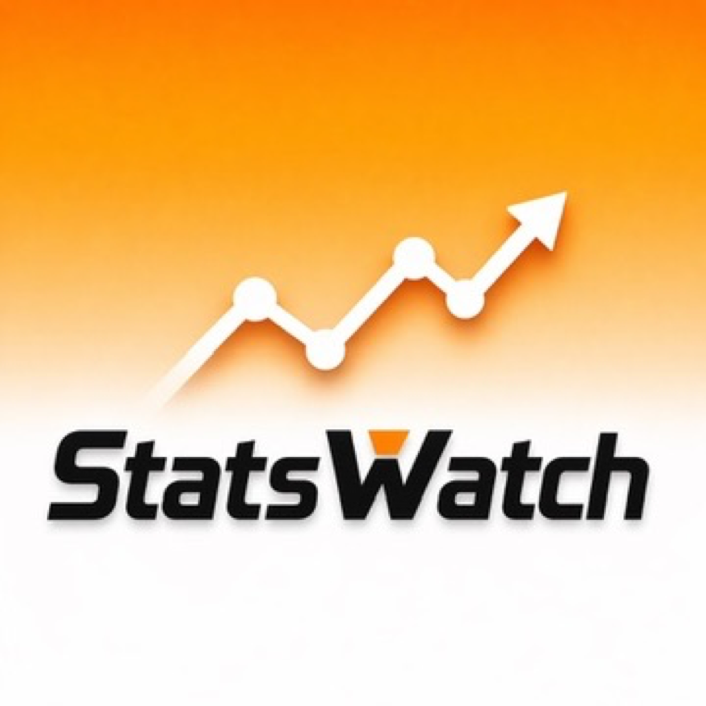
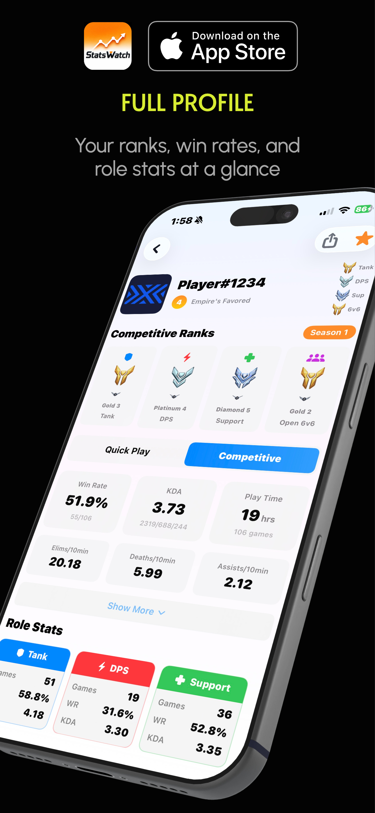
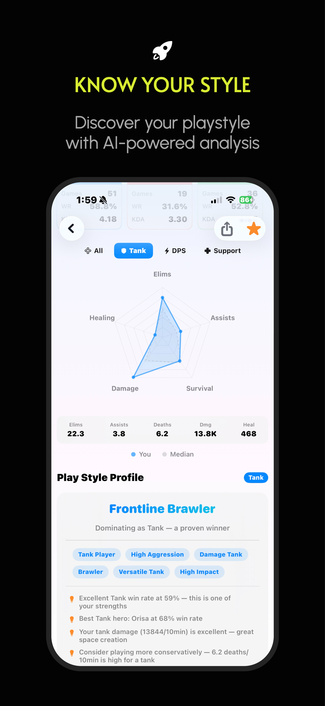
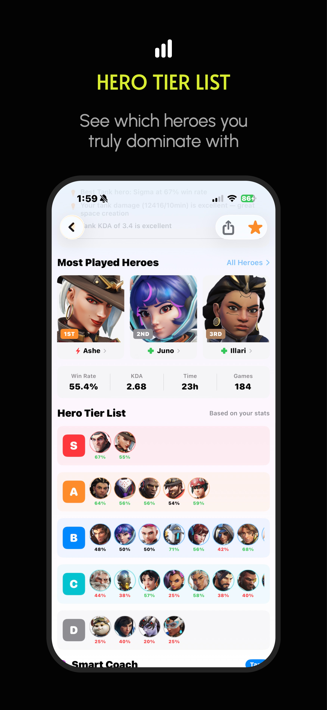
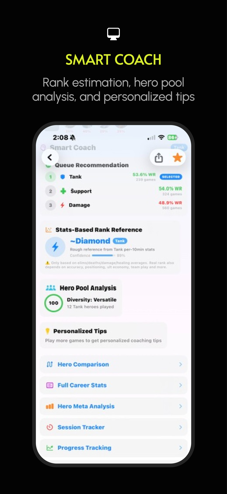
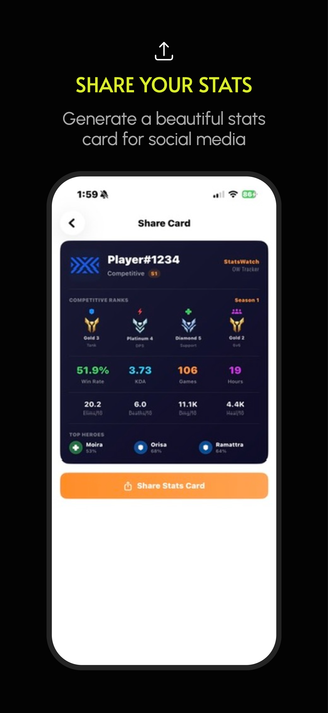
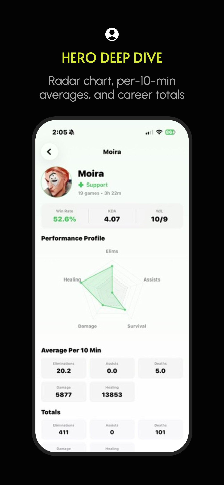
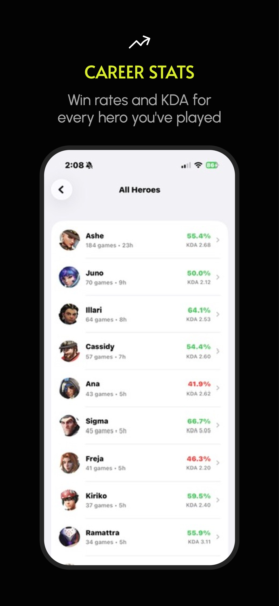
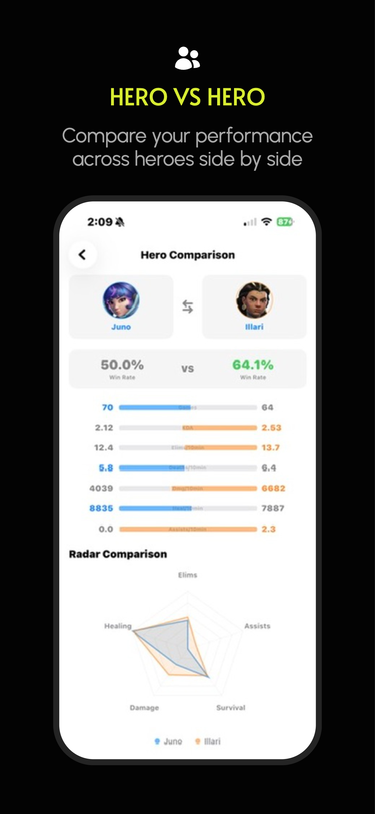

<div align="center">

#  StatsWatch

### Your Ultimate Overwatch Companion on iOS

**Track stats. Master heroes. Climb ranks.**

[](https://swift.org)
[](https://apple.com)
[](LICENSE)

[**中文介绍**](#中文介绍) · [Features](#features) · [Screenshots](#screenshots) · [Installation](#installation) · [Tech Stack](#tech-stack)

</div>

---

## Features

### Player Stats & Analysis
- **Full Profile Viewer** — Search any player by BattleTag, view competitive ranks, win rates, KDA, playtime across all roles
- **Smart Coach** — AI-powered insights: rank estimation, hero pool analysis, personalized improvement tips that adapt to your selected role
- **Play Style Profile** — Discover your playstyle archetype (Aggressive Slayer, Battle Medic, Protective Guardian, etc.) with trait tags and key insights
- **Hero Tier List** — Personal S/A/B/C/D tier ranking based on YOUR performance, not generic meta picks

### Hero & Meta Intelligence
- **Hero Meta Analysis** — Global pick rates and win rates across all heroes, filterable by role and game mode
- **Hero Encyclopedia** — Complete hero database with abilities, hitpoints, backstories, and global performance stats
- **Career Stats Deep Dive** — Per-hero career statistics with category breakdowns (Best, Combat, Game, etc.)

### Competitive Tools
- **Player vs Player** — Compare two players side-by-side with stat bars and role breakdowns
- **Session Tracker** — Start a session before playing, end it after — see exactly how many wins/losses and stat changes per session
- **Progress Tracking** — Historical stat snapshots with line charts to visualize your improvement over time

### Social & Utility
- **Share Card** — Generate a beautiful dark-themed stats card with your ranks, top heroes, and key stats — ready to share on social media
- **Favorites & History** — Save frequent players, quick access to recent searches
- **iOS Home Screen Widget** — Glance at your latest stats without opening the app
- **Maps & Game Modes Gallery** — Browse all maps with game mode filters and country flags

### Global
- **5 Languages** — English, 简体中文, 한국어, 日本語, Español — with in-app language switcher
- **100% Free, No Ads** — Built for the community

---

## Screenshots

| Full Profile | Know Your Style | Hero Tier List | Smart Coach |
|:---:|:---:|:---:|:---:|
|  |  |  |  |
| Ranks, win rates & role stats | AI-powered playstyle analysis | Your personal S/A/B/C/D ranking | Rank estimation & personalized tips |

| Share Card | Hero Deep Dive | Career Stats | Hero vs Hero |
|:---:|:---:|:---:|:---:|
|  |  |  |  |
| Beautiful stats card for sharing | Radar chart & per-10-min averages | Win rates & KDA for every hero | Compare your heroes side by side |

---

## Installation
- Will be avalable on AppStore soon

### Requirements
- iOS 18.0+
- Xcode 26.0+

### Build from Source
```bash
git clone https://github.com/WilliamGuo2002/StatsWatch.git
cd StatsWatch
open StatsWatch.xcodeproj
```
Select your target device/simulator in Xcode and hit **Run (⌘R)**.

No external dependencies — no CocoaPods, no SPM packages. Pure SwiftUI.

---

## Tech Stack

| Layer | Technology |
|---|---|
| UI | SwiftUI, Charts |
| Architecture | @Observable ViewModel, Actor-based services |
| Data Source | [OverFast API](https://overfast-api.tekrop.fr) (all 12 endpoints) |
| Persistence | UserDefaults (local only) |
| Widget | WidgetKit + App Groups |
| Localization | Localizable.strings × 5 languages |
| Image Export | ImageRenderer |

---

## API Coverage

StatsWatch utilizes **100%** of the OverFast API endpoints:

| Endpoint | Usage |
|---|---|
| `/players` | Player search |
| `/players/{id}/summary` | Profile, ranks, endorsement |
| `/players/{id}/stats/summary` | Win rates, KDA, per-10min stats |
| `/players/{id}/stats/career` | Detailed per-hero career stats |
| `/heroes` | Hero list for encyclopedia & meta |
| `/heroes/{id}` | Hero detail (abilities, story, hitpoints) |
| `/heroes/stats` | Global hero pick/win rates |
| `/maps` | Map gallery |
| `/gamemodes` | Game modes browser |
| `/roles` | Role metadata |

---

## Privacy

StatsWatch does **not** collect, store, or transmit any personal data. All user preferences (favorites, search history, stat snapshots) are stored **locally on the device** via UserDefaults. Player data is fetched from publicly available profiles through the OverFast API.

---

## Disclaimer

This is an **unofficial** fan-made application and is not affiliated with, endorsed by, or connected to Blizzard Entertainment, Inc. *Overwatch*, the Overwatch logo, and all related heroes, names, images, and assets are trademarks or registered trademarks of Blizzard Entertainment, Inc.

---

## Support

- **Bug Report / Feature Request** — In-app Feedback & Tip page, or email [wgstudiosupport@gmail.com](mailto:wgstudiosupport@gmail.com)
- **Tip the Developer** — [PayPal](https://paypal.me/wg1018)

---

<div align="center">

Made with ❤️ for the Overwatch community

</div>

---

<a id="中文介绍"></a>

## 中文介绍

### StatsWatch — 你的守望先锋 iOS 数据伴侣

**查战绩、研究英雄、冲分必备。**

### 核心功能

**数据查询**
- 搜索任意玩家战网ID，查看竞技排名、胜率、KDA、游戏时长
- 支持竞技模式 / 快速游戏切换，显示各职业段位

**智能分析**
- 🧠 **智能教练** — 段位参考估算、英雄池分析、个性化建议，根据选择的职业显示不同内容
- 🎭 **游戏风格画像** — 分析你的风格类型（激进杀手、战斗奶妈、钢铁堡垒...）
- 📊 **英雄等级表** — 基于你自己的数据，S/A/B/C/D 分级你最擅长的英雄

**英雄与 Meta**
- 全英雄 Meta 选取率 / 胜率排行，按职业和模式筛选
- 完整英雄百科：技能、血量、背景故事、全球数据
- 每个英雄的详细生涯数据

**竞技工具**
- ⚔️ **玩家 PvP 对比** — 两个玩家数据并排对比
- ⏱️ **对局追踪** — 开打前记录，打完后查看胜负变化
- 📈 **进步追踪** — 历史数据折线图，见证你的成长

**社交与实用**
- 🎴 **分享卡片** — 生成精美深色主题数据卡，一键分享到社交媒体
- ⭐ **收藏与历史** — 快速访问常用玩家
- 📱 **桌面小组件** — 不打开 App 也能看到最新数据
- 🗺️ **地图与模式** — 浏览所有地图和游戏模式

### 多语言

支持 English、简体中文、한국어、日本語、Español，可在 App 内随时切换。

### 隐私

StatsWatch **不收集任何个人数据**。所有收藏、搜索历史等信息仅存储在你的设备本地。

### 联系

- 问题反馈 / 功能建议 — App 内反馈页面 或 邮件 [wgstudiosupport@gmail.com](mailto:wgstudiosupport@gmail.com)
- 打赏支持 — [PayPal](https://paypal.me/wg1018)

---

<div align="center">

**为守望先锋社区用心打造** 🎮

</div>
